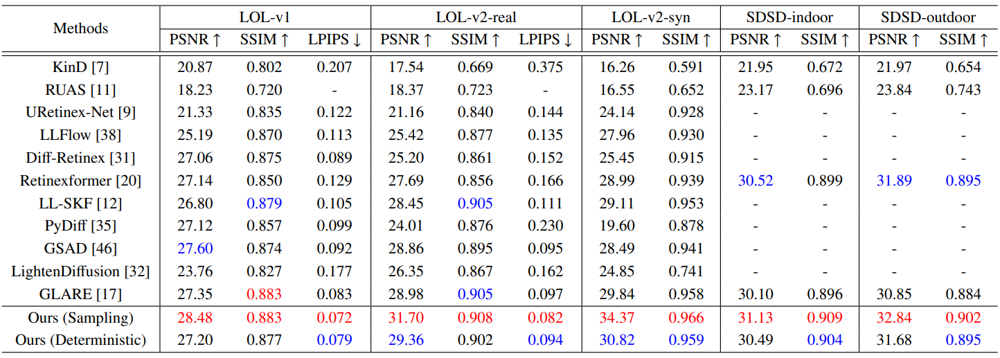
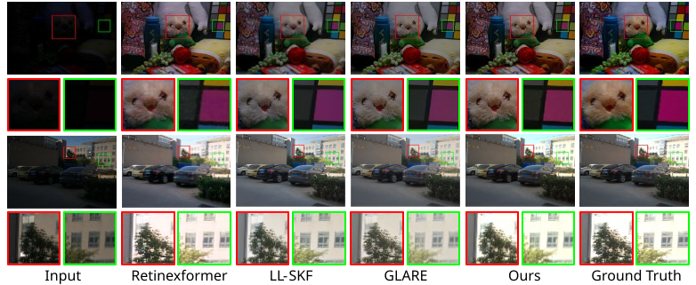

# Low-light Image Enhancement via Distribution of Latent Transitions

This repository provides the official PyTorch implementation of the paper:  
**["Low-light Image Enhancement via Distribution of Latent Transitions"](https://www.sciencedirect.com/science/article/pii/S1047320326001203?dgcid=coauthor)** 

**Jaehun Jung** and [**Wonjun Kim** (Corresponding Author)](https://sites.google.com/view/dcvl)  

_Journal of Visual Communication and Image Representation (JVCI)_

## ⚙️ Installation

### 🐍 Environment Setup
```bash
conda create -n Dedarkening python=3.7
conda activate Dedarkening
```

### 📦 Install Dependencies
```bash
conda install pytorch=1.11 torchvision cudatoolkit=11.3 -c pytorch
pip install matplotlib scikit-learn scikit-image opencv-python yacs joblib natsort h5py tqdm tensorboard
pip install einops gdown addict future lmdb numpy pyyaml requests scipy yapf lpips
```

### 🛠️ Build BasicSR
```bash
python setup.py develop --no_cuda_ext
```

## 📂 Datasets

All datasets used for **training and evaluation** can be downloaded from [Repository](https://github.com/caiyuanhao1998/retinexformer).

Please organize the downloaded datasets in the `./data/` directory as shown below:

```text
./data/
├── LOLv1/
│   ├── Train/
│   │   ├── input/
│   │   └── target/
│   └── Test/
│       ├── input/
│       └── target/
├── LOLv2/
│   ├── Real_captured/
│   │   ├── Train/
│   │   │   ├── Low/
│   │   │   └── Normal/
│   │   └── Test/
│   │       ├── Low/
│   │       └── Normal/
│   └── Synthetic/
│       ├── Train/
│       │   ├── Low/
│       │   └── Normal/
│       └── Test/
│           ├── Low/
│           └── Normal/
└── SDSD/
    ├── indoor_static_np/
    │   ├── input/
    │   └── GT/
    └── outdoor_static_np/
        ├── input/
        └── GT/
```

## ⚡ Run Inference
You can download our pre-trained models from [Google Drive](https://drive.google.com/drive/folders/1eRg2nJJIce9i5QQJxNwsBZyKD3qSn9rm?usp=drive_link). After downloading, please place the model weights (`.pth` files) in the `./pre_weights/` folder.

```bash
# Activate the environment
conda activate Dedarkening

# Evaluate on the LOL-v1 dataset
python Enhancement/test_from_dataset.py --opt Options/LOLv1.yml --weights pre_weights/LOLv1.pth --dataset LOLv1 --GT_mean --sampling -n 70

# Evaluate on the LOL-v2-real dataset
python Enhancement/test_from_dataset.py --opt Options/LOLv2_real.yml --weights pre_weights/LOLv2_real.pth --dataset LOLv2_real --GT_mean --sampling -n 70

# Evaluate on the LOL-v2-syn dataset
python Enhancement/test_from_dataset.py --opt Options/LOLv2_synthesis.yml --weights pre_weights/LOLv2_synthesis.pth --dataset LOLv2_syn --GT_mean --sampling -n 70

# Evaluate on the SDSD-indoor dataset
python Enhancement/test_from_dataset.py --opt Options/SDSD_indoor.yml --weights pre_weights/SDSD_indoor.pth --dataset SDSD_indoor --GT_mean --sampling -n 70

# Evaluate on the SDSD-outdoor dataset
python Enhancement/test_from_dataset.py --opt Options/SDSD_outdoor.yml --weights pre_weights/SDSD_outdoor.pth --dataset SDSD_outdoor --GT_mean --sampling -n 70
```

> **💡 Tip: Deterministic Inference** > If you want to run deterministic inference, simply remove the `--sampling` and `-n 70` arguments from the command:
> ```bash
> python Enhancement/test_from_dataset.py --opt Options/LOLv1.yml --weights pre_weights/LOLv1.pth --dataset LOLv1 --GT_mean
> ```

## 🏋️ Training

```bash
# Activate the environment
conda activate Dedarkening

# Train on the LOL-v1
python3 basicsr/train.py --opt Options/LOLv1.yml

# Train on the LOL-v2-real
python3 basicsr/train.py --opt Options/LOLv2_real.yml

# Train on the LOL-v2-synthetic
python3 basicsr/train.py --opt Options/LOLv2_synthetic.yml

# Train on the SDSD-indoor dataset
python3 basicsr/train.py --opt Options/SDSD_indoor.yml

# Train on the SDSD-outdoor dataset
python3 basicsr/train.py --opt Options/SDSD_outdoor.yml
```

## 📊 Results

### Quantitative Results
 
### Qualitative Results


## 📎 Citation

If you find this work helpful, please consider citing:

```bibtex
@article{jung2026low,
  title={Low-light Image Enhancement via Distribution of Latent Transitions},
  author={Jung, Jaehun and Kim, Wonjun},
  journal={Journal of Visual Communication and Image Representation},
  volume={118},
  pages={104825},
  year={2026},
  publisher={Elsevier}
}
```

---

## 📫 Contact

If you have any questions or issues, feel free to reach out:

- **Jaehun Jung**: [brian111725@konkuk.ac.kr]  
